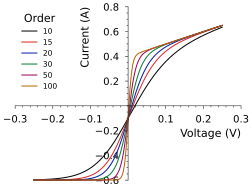

CentredAxes Context Manager
===========================

.. currentmodule:: stonerplots.context.noframe

Use :py:class:`CentredAxes` when you want to make a plot where the axes are not on a frame around the outside edge of the plot,
but cross through the origin or some other specific point. This context manager will collect any new axes that
have been created within it and then relocate the axes and remove the frame.::

    with CentredAxes(x=0,y=0):
        fig, ax = plt.subplots()
        for p in [10, 15, 20, 30, 50, 100]:
            ax.plot(x-1, model(x, p)-0.6, label=p, marker="")
        ax.legend(title="Order", fontsize="small")
        ax.autoscale(tight=True)
        ax.set(**pparam)

Optional Parameters
-------------------

:py:class:`CentredAxes` takes relatively few parameters. *x* and *y* set the location of the y-axis and x-axis respectively,
similarly to :py:class:`stonerplots.SavedFigure`, *include-open* can be used to adopt already open figures and their axes,
and a *use* parameter lets you specify an already partially completed figure to continue to work with.
