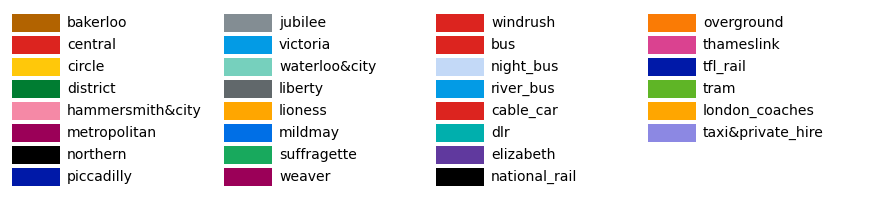
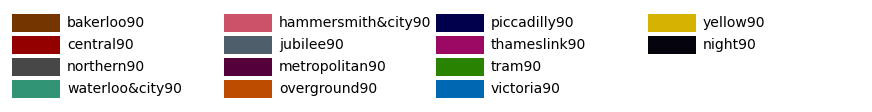
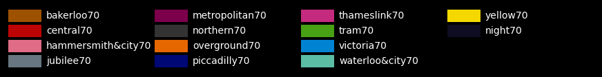
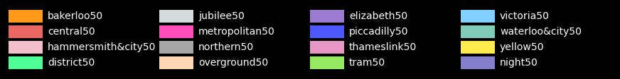
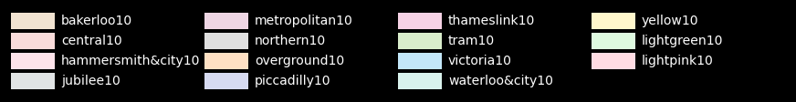

StonerPlot Colours
==================

The StonerPlots package default style ('stoner') includes a colour and line marker cycler. The colours used are
taken from the Tansport for London colour palette (aka the Tube map) as they are a nice set of bold colours that
show up well on white backgrounds.

In addition, the package patches the matplotlib list of named colours so that you can use the colours directly -
according to their tube/transport line. This maybe on makes sense to Brits!

Tube Map Colours
----------------

Tube Map 90% Shade Colours
--------------------------

Tube Map 70% Shade Colours
--------------------------

Tube Map 50% Shade Colours
--------------------------

Tube Map 10% Shade Colours
--------------------------

