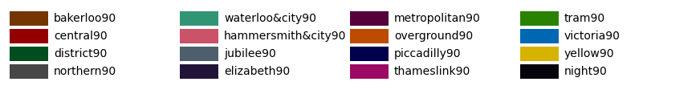
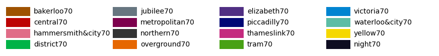
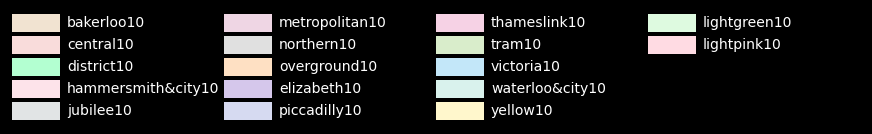

StonerPlot Colours
===================

The StonerPlots package provides a default style ('stoner') that includes a colour and line marker cycler. The colours used are
inspired by the **Transport for London (TfL)** colour palette (better known as the Tube map palette). This palette features
a vibrant collection of bold colours, which are particularly effective for visualizations with white backgrounds.

Additionally, the StonerPlots package extends the default list of named colours in matplotlib. This allows users to directly reference
these colours by the names of the London Underground lines (e.g., 'bakerloo', 'central') in their visualizations. However, this naming
may be most intuitive for users familiar with the London Underground system!

**Why use the TfL palette?**

- Visually appealing: The bold colours stand out against light and white backgrounds.
- Consistency: Named options provide an easier way to stylize plots systematically.
- Hierarchical shades: The palette includes predefined shades (e.g., 90%, 70%, etc.), offering flexibility while maintaining a unified look.

Tube Map Colours
-----------------
The full set of Tube map colours is shown below. The colours correspond to the official line names.

.. image:: figures/colours.png
   :alt: Full tube map colour palette
   :align: center
   :width: 600px

Tube Map 90% Shade Colours
---------------------------
The 90% shade of each Tube line's colour offers a slightly darker tone while still preserving the colour identity.
These shades are particularly effective for creating layered or hierarchical plots.

Tube Map 70% Shade Colours
---------------------------
The 70% shades provide an intermediate level of opacity, useful for combining multiple elements on a plot while maintaining
distinction.

Tube Map 50% Shade Colours
---------------------------
The 50% shades offer further blending opportunities, creating a subtler appearance for secondary elements in plots.

Tube Map 10% Shade Colours
---------------------------
The 10% shades, being faint versions of the original Tube map colours, can be used for plot backgrounds, grids, or
less prominent plot elements.

Using the StonerPlots Colour Palette
------------------------------------
The StonerPlots colour palette integrates seamlessly with matplotlib, allowing you to use colours based on their Tube map names.
Here's an example of how the colour names could correspond to their respective London Underground lines:

+-------------------+--------------------+
| Tube Line         | Colour (Hex Code)  |
+===================+====================+
| Bakerloo          | #B36305            |
|                   |                    |
| Central           | #E32017            |
|                   |                    |
| Circle            | #FFD300            |
|                   |                    |
| District          | #00782A            |
|                   |                    |
| Hammersmith & City| #F3A9BB            |
|                   |                    |
| Jubilee           | #A0A5A9            |
|                   |                    |
| Metropolitan      | #9B0056            |
|                   |                    |
| Northern          | #000000            |
|                   |                    |
| Piccadilly        | #003688            |
|                   |                    |
| Victoria          | #0098D4            |
|                   |                    |
| Waterloo & City   | #95CDBA            |
+-------------------+--------------------+

For shades, consider appending `90`, `70`, etc., to form a hierarchy of shades for the respective lines.

.. note::

    - If you're unfamiliar with the TfL Tube map colours, they are based on London's underground transport line colours.
      More details can be found [here on Transport for London's Blog](https://blog.tfl.gov.uk/2022/12/22/digital-colour-standard/).
