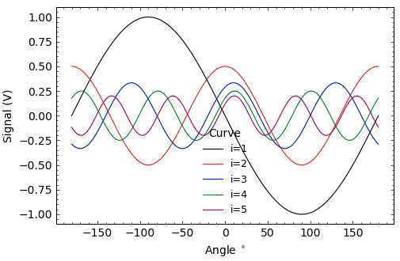

.. StonerPlots documentation master file, created by
   sphinx-quickstart on Wed Mar 27 11:46:49 2024.
   You can adapt this file completely to your liking, but it should at least
   contain the root `toctree` directive.

Welcome to StonerPlots's documentation!
=======================================

.. toctree::
   :maxdepth: 2
   :caption: Contents:

Introduction
------------

StonerPlots is a package to help make publication quality matplotlib figures more easily. In particular,
it is indended to create plots that match the style of common Physics journals, but equally can help
keep matplotlib figures consistent for writing reports and theses.

It originated as a fork of the scienceplots package by John D. Garrett

Quickstart
----------

Installation
~~~~~~~~~~~~

StonerPlots can be installed wither with pip or with conda::

    pip install stonerplots

Conda packages are uploaded to the Anaconda channel phygbu::

    conda install -c phygbu stonerplots

It is packaged for python >= 3.10 and you need to have matplotlib installed as well (obviously!). The
example code also uses numpy.

Example
~~~~~~~

The easiest way to get started is to use the SavedFigure context manager. This both applies the requested
styles and also collects any new figures and saves them to disk.::

    x = np.linspace(-np.pi,np.pi,181)
    params = {"xlabel":r"Angle $^\circ$","ylabel":"Signal (V)"}

    with SavedFigure(figures / "example-1.png"):
        fig, ax = plt.subplots()
        for i in range(1,6):
            ax.plot(x*180/np.pi,(1/i)*np.sin(x*i+np.pi/i),
                                    marker="", label=f"{i=}")
        ax.legend(title="Curve")
        ax.set(**params)

In this example, the new figure will be saved as example-1.png (auto-detecting the png format) in the path *figures*. and the
default "stoner" stylesheet will be applied.

Sections
========

.. toctree::
   :maxdepth: 2

   User Guide <userguide>
   Style Gallery <style-gallery>
   Colours <colours>
   API <api>

Indices and tables
==================

* :ref:`genindex`
* :ref:`modindex`
* :ref:`search`
