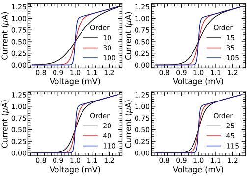
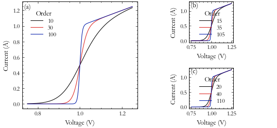

MultiPanel Context Manager
==========================

.. currentmodule:: stonerplots.context

Another common requirement when writing papers and theses is to create a figure with several distinct panels showing
different (related) datasets. In this case, the :py:class:`MultiPanel` context manager works in a very analogous way to the
:py:class:`StackVertical` context manager.::

    with MultiPanel((2,2)) as axes:
    for ax,x,y in zip (axes,[x1,x2,x3,x4],[y1,y2,y3,y4]):
        ax.plot(x,y)

The only required parameter is the number of panels to show. This can be either
 - a tuple of (n_rows,n_cols), or
- an integer specifying a number of columns (number of rows is assumed to be one in this case), or
 - a list of [row_1_plots, row_2_plots....] to specify a different number of plots on each row

Optional Parameters
-------------------

The `figure`, `sharex`, `sharey` and `label_panels` work exactly as for the :py:class:`StackVertical` Context manager
described above, except that the default is not to share any axes - see `Stacked Plots<stackvertical>` for more
details.

The `adjust_figsize` parameter allows you to specify a tuple defining distinct expansion factors for width and height. The

The default value is to expand the width by exactly the number of columns and the height by the height of one row + 80% of
additional rows. Since full-page width figures are more than double a single column, it may be useful to do something
like::

    with SavedFigure("example.png",stle=["stoner","aip","aip2"]):
        with MultiPanel((1,2),adjust_figsize=(0,0.12)) as axes:
            for ax,x,y in zip (axes,[x1,x2,x3,x4],[y1,y2,y3,y4]):
                ax.plot(x,y)

To create a figure that spans the full width and is two single plots tall.

For the figure below (from the style gallery), the *adjust_figsize* was set to (0,-0.25), meaning that width was
preserved, and height was reduced by a factor of -25%. Whilst a positive expansion factor is applied to the additional
rows, the negative value is applied to the original figure size. (The logic here is that the times you are needing to
to shrink the original figure size is when the final aspect ratio will be higher than the original figure).

.. image:: ../../examples/figures/fig02h_1.png
  :alt: Example showing a single row of two sub-plots created using MultiPanel
  :align: centre

Use with Presentation Style
---------------------------

Combining py:class:`MultiPanel` with the `presentation` style sheet is a good way to prepare multiple graphs for
a single slide. The default behaviour of the `adjust_figsize` is unhelpful as the `presentation` style sheet already
sets a good figure size to use. You may also not want to label the individual panels.::

    with SavedFigure("fig7e.svg", style="stoner,presentation"):
        fig = plt.figure()
        with MultiPanel((2, 2),adjust_figsize=False, label_panels=False) as axes:
            for ix, ax in enumerate(axes):
                for p in [10, 30, 100]:
                    ax.plot(x, model(x, p + ix * 5), label=p + ix * 5, marker="")
                ...

  :alt: Using MultiPanel and presentation style sheet together.
  :align: centre

Different Numbers of Plots on Each Row
--------------------------------------

`MultiPanel` can also be used to create arrangements where there are different numbers of
subplots on different rows on the figure. For example, if you want to have three subplots and they don't
conveniently fit on a single row, you might have 1 and then 2 plots, or 2 and then 1 plot. This can be
achieved by using a list of plots per row as the first argument in conjunction with an optional
 `same_aspect`.::

    with SavedFigure("3-plot.png",style="stoner,thesis"):
        fig=plt.figure("tri-plot")
        with MultiPanel([2,1], adjust_figsize=False) as axes:
            for ix,ax in enumerate(axes):
                ax.plot(x_data[ix], y_data[ix], marker="")
                ...

By default, Lpy:class:`MultiPanel` will adjust the aspect
to match the narrowest figure unless
you specify *same_aspect* to be False, or give *width_ratios* or *height_ratios* to manually change the
aspect ratios of the plots.

.. image:: ../../examples/figures/triplot.png

  :alt: An example of a triple-panel sub-plot arranged in two rows.
  :align: centre

With the optional `transpose` argument, the `MultiPanel` will create a grid of plots, with each column potentially containing a different number of rows.
of rows is different for each column::

    with SavedFigure("3-plot.png",style="stoner,thesis"):
        fig=plt.figure("tri-plot-transpose")
        with MultiPanel([1,2], transpose=True, adjust_figsize=(0,-0.25)) as axes:
            for ix,ax in enumerate(axes):
                ax.plot(x_data[ix], y_data[ix], marker="")
                ...

Using the context manager variable
The object returned when you enter the context exposes several useful bits of functionality. Firstly, if you iterate
over the object it will return the individual plot axes - but it will also set pyplot's current axes so that the
The object returned when you enter the context exposes several useful bits of functionality. Firstly, if you iterate
over the object it will return the individual polot axes - but it will also set pyplot's current axes so that the
`matplotlib.pyplot` interactive interface will work and switch between the plots as it iterates::

    fig=plt.figure("tri-plot-b")
    with MultiPanel([2,1], adjust_figsize=False) as panels:
        for ix, _ in enumerate(panels):
            plt.plot(x_data[ix], y_data[ix], marker="")
            plt.xlabel("Voltage (mV)")
            plt.ylabel("Current ($\\mu$A)")
            ...

You can also access the underlying list or array of `matplotlib.axes.Axes` instances with the `axes`
attribute and the :py:class:`matplotlib.gridspec.gridspec` used for the multi-panel plot. Indexing the context manager
variable can also give acces to the individual plots (or rows of plots if a single index is given). If the result of
attribute and the `matplotlib.gridspec.gridspec` used for the multi-panel plot. Indexing the context manager
variable can also give access to the individual plots (or rows of plots if a single index is given).

    fig=plt.figure("tri-plot-c")
    with MultiPanel([2,1], adjust_figsize=False) as panels:
        ax=panels[0,0] # Also set ax to be current axes
        plt.plot(x,y,...)

