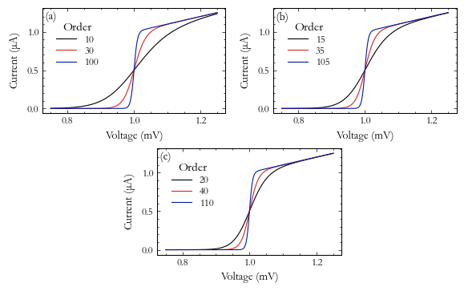

MultiPanel Context Manager
==========================

.. currentmodule:: stonerplots.context

Another common requirement when writing papers and theses is to create a figure with several distinct panels shwing
different (related) datasets. In this case, the :py:class:`MultiPanel` context manager works in a very analogous way to the
:py:class:`StackVertical` context manager.::

    with MultiPanel((2,2)) as axes:
    for ax,x,y in zip (axes,[x1,x2,x3,x4],[y1,y2,y3,y4]):
        ax.plot(x,y)

The only required parameter is the number of panels to show. This can be either a tuple of (n_rows,n_cols) or an
integer specifying a number of columns (number of rows is assumed to be one in this case.)

Optional Parameters
-------------------

The *figure*, *sharex*, *sharey* and *label_panels* work exactly as for the :py:class:`StackVertical` Context manager
described above, except that the default is not to share any axes - see `Stacked Plots<stackvertical>` for more
details.

The *adjust_figsize* parameter lets you specify a tuple to give different expansion factors for width and height. The
default value is to expand the width by exactly the number of columns and the height by the height of one row + 80% of
additional rows. Since full-page width figures are more than double a single column, it may be useful to do something
like::

    with SavedFigure("example.png",stle=["stoner","aip","aip2"]):
        with MultiPanel((2,2),adjust_figsize=(0,0.12)) as axes:
            for ax,x,y in zip (axes,[x1,x2,x3,x4],[y1,y2,y3,y4]):
                ax.plot(x,y)

To make a genuinely full width x 2 single plots high figure.

For the figure below (from the style gallery), the *adjust_figsize* was set to (0,-0.25), meaning that width was
preserved, and height was reduced by a factor of -25%. Whilst a postivie expansion factor is applied to the additional
rows, the negative value is applied to the original figure size. (The logic here is that the times you are needing to
shrink the original figure size is when the final aspect ratio will be higher than the original figure.)

.. image:: ../../examples/figures/fig02h_1.png
  :alt: A single row of 2 sub-plats created from MultiPanel
  :align: center

Different Numbers of Plots on Each Row
--------------------------------------

:py:class:`MultiPanel` can also be used to create arrangements where there are different numbers of
subplots on different rows on the figure. For example, if you want to have three subplots and they don't
conveniently fit on a single row, you might have 1 and then 2 plots, or 2 and then 1 plot. This can be
achieved by using the *nplots* argument in conunction with an optional *same_aspect*.::

    with SavedFigure("3-plot.png",style="stoner,thesis", autoclose=True):
        fig=plt.figure("tri-plot")
        with MultiPanel((2,2), nplots=[2,1], adjust_figsize=False) as axes:
            for ix,ax in enumerate(axes):
                ax.plot(x_data[ix], y_data[ix], marker="")
                ...

*nplots* gives the number of plots on each row of the layout (so the length of *nplots* must be the same
as the first number in the numnber of panels and each entry must be between 1 and the second number
in the number of panels). By default, Lpy:class:`MultiPanel` will adjust the aspect
ratio of all the subplots after the plotting is done to make them the same as the narrowerst figure unless
you specify *same_aspect* to be False, or give *width_ratios* or *height_ratios* to manually change the
aspect ratios of the plots.

Using the context manager variable
----------------------------------

The object returned when you enter the context exposes several useful bits of functionality. Firstly, if you iterate
over the object it will return the individual polot axes - but it will also set pyplot's current axes so that the
:py:mod:`matplotlib.pyplot` interactive interface will work and switch between the plots as it iterates.::

    fig=plt.figure("tri-plot-b")
    with MultiPanel((2,2), nplots=[2,1], adjust_figsize=False) as panels:
        for ix,_ in enumerate(panels):
            plt.plot(x_data[ix], y_data[ix], marker="")
            plt.xlable("Voltage (mV)")
            plt.ylabel("Current ($\\mu$A)")
            ...

You can also access the underlying list or array of :py:class:`matplotlib.axes.Axes` instances with the `axes`
attribute and the :py:class:`matplotlib.gridspec.gridspec` used for the multi-panel plot. Indexing the context manager
variable can also give acces to the individual plots (or rows of plots if a single index is given). If the result of
indexing the context manager variable is a :py:class:`matplotlib.axes.Axes` instance, then the
:py:mod:`matplotlib.pyplot` currewnt axes is also updated.::

    fig=plt.figure("tri-plot-c")
    with MultiPanel((2,2), nplots=[2,1], adjust_figsize=False) as panels:
        ax=panels[0,0] # Also set ax to be current axes
        plt.plot(x,y,...)
