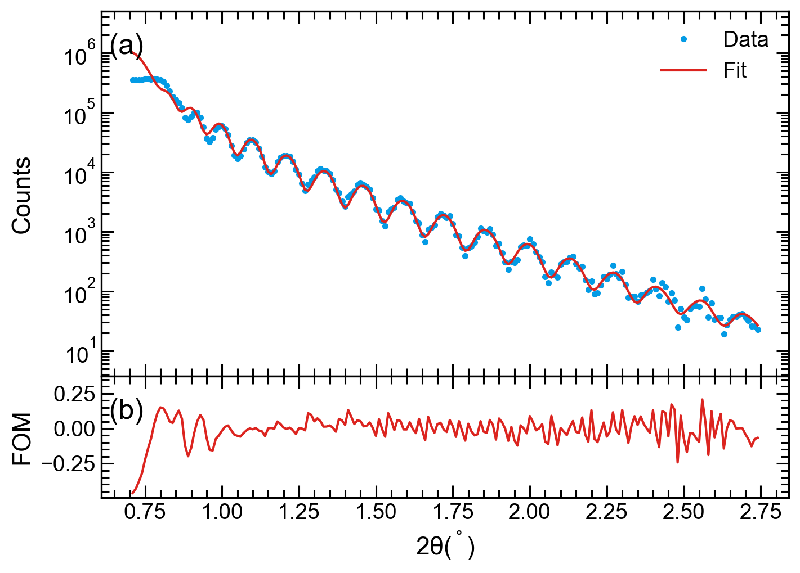

StackVertical Context Manager
-----------------------------

.. currentmodule:: stonerplots.context

When comparing several quantities that have a common independent variable, using a sequence of vertically stacked plots
can be effective. Typically each sub-plot is positioned so that the top x-axis of one panel is the bottom x-axis of the
one above, and only the bottom x-axis of the whole stack is labelled and.

Although matplotlib's builtin features to make multiple plots on a grid have been improved in recent releases, it is
still quite complex and getting the plots to be adjacent, whilst also not having the labels etc clash is challenging.
:py:class:`StackVertical` is a context manager designed to make this a bit easier.::

    with StackVertical(3) as axes:
        for ax,y in zip(axes, [y_data1, y_data2, y_data3]):
            ax.plot(x, y)

The only required parameter to :py:class:`StackVertical` is the number of plots to stack vertically. It then returns a list of the
:py:class:`matplotlib.axes.Axes` for each subplot - the first set of axes being the top plot and the last being the
bottom.

When the context manager exits, it adjusts the y-axis limits to ensure the tick markers do not interfere and reduces
the spacing between the plots to zero so that they are adjacent.

Adjusting the Figure Size for the Stack
~~~~~~~~~~~~~~~~~~~~~~~~~~~~~~~~~~~~~~~

BY default :py:class:`StackVertical` will look at the current figure to work out its dimensions and will then assume that this is
the correct size for a single plot. It will then adjust the figure height to accommodate the additional stacked plots.
The equation used for this is:

.. math::
   h_{new} = h_{old} (f h_{old} (N_{plots}-1)+1)

with :math:`f` being a fraction of the old plot size set by the *adjust_figsize* parameter to :py:class:`StackVertical`.
If this is left at the default value of `True`, then :math:`f` is set to 0.6 and to 0 if *adjust_figsize* is `False`.

Typically stacked plots have a bigger aspect ratio (width:height) than a single plot.::

    with StackVertical(3, adjust_figsize=0.5) as axes:
        for ax,y in zip(axes, [y_data1, y_data2, y_data3]):
            ax.plot(x, y)

Setting Common (Shared) axes
~~~~~~~~~~~~~~~~~~~~~~~~~~~~

By default :py:class:`StackVertical` will set the x-axis to be shared between all the plots and the y-axis of each plot to be
independent. The *sharex* and *sharey* parameters control this. When the plots are adjacent it probably doesn't make
sense to not share the x-axis though!::

    with StackVertical(3, sharey=True) as axes:
        for ax,y in zip(axes, [y_data1, y_data2, y_data3]):
            ax.plot(x, y)

Labelling the Panels
~~~~~~~~~~~~~~~~~~~~

A common requirement of a multi-panel figure is to label the individual sets of axes (a), (b)... or similar. This is
supported by the *label_panels* parameter. If this takes the value `True` then each set of axes is labelled '(a)',
'(b)' and so on. For added control, the parameter can also take a string with a similar format to that used in
:py:class:`SavedFigure` above. Placeholders such as {Alpha} or {roman} can be used and will give the axes number.::

    with StackVertical(3, label_panels=True) as axes:
        for ax,y in zip(axes, [y_data1, y_data2, y_data3]):
            ax.plot(x, y)

Some journals, e.g. Science, also want the label to be in bold font, and :py:class:`StackVertical` supports passing the font...
jeyword arguments to control the font size and appearance.::

    with StackVertical(3, label_panels='{Alpha}', fontweight='bold') as axes:
        for ax,y in zip(axes, [y_data1, y_data2, y_data3]):
            ax.plot(x, y)

Specifying a Figure
~~~~~~~~~~~~~~~~~~~

The default is to use the current matplotlib figure, but by passing the *figure* parameter into the :py:class:`StackVertical`
context manager it will use that figure instead.::

    with StackVertical(3, figure=2) as axes:
        for ax,y in zip(axes, [y_data1, y_data2, y_data3]):
            ax.plot(x, y)

The *figure* parameter can be either a :py:class:`matplotlib.figure.Figure` or a figure number or figure label. Within
the context manager, the current figure is set to be figure specified by the *figure* parameter. The previously active
figure is reset as active when the context manager exits.

Not Joining the Plots
~~~~~~~~~~~~~~~~~~~~~

Although it is envisaged that the main use of the :py:class:`StackVertical` context manager is to make plots with shared x-axes and
sitting adjacent to each other, setting the *joined* parameter to `False` will stop the post-plotting re-sizing and
adjustment of the y-limits and therefore set the plots as separate enties.::

    with StackVertical(3, joined=False) as axes:
        for ax,y in zip(axes, [y_data1, y_data2, y_data3]):
            ax.plot(x, y)

Advanced Usage
~~~~~~~~~~~~~~

You can also pass a *heights_ratio* into the :py:class:`StackVertical` to control the relative heights of the plots.
A use for this is when you have a primary set of data and a related subsiduary data set. For example, in fitting a set
of data one might show the data and fit on the main panel and the residuals or a figure of merit in  a secondary panel.::

    import numpy as np
    import matplotlib.pyplot as plt
    from stonerplots import SavedFigure, StackVertical

    # Prepare data assuming a data format of x,y_fit,y_obs
    data = np.genfromtxt(Path(__file__).parent.parent / "data" / "xrr.dat")
    x = data[:, 0]
    fit = data[:, 1]
    measured = data[:, 2]
    fom = np.log10(measured) - np.log10(fit)

    # Set up the scales, labels etc for the two panels.
    main_props = {"ylabel": "Counts", "yscale": "log","ylim":(10,5E6)}
    residual_poprs = {"xlabel": r"2$\theta (^\circ)$", "ylabel": "FOM"}

    # This is stonerplots context managers at work
    with SavedFigure(figures / "genx_plot.png", style=["stoner", "presentation"], autoclose=True):
        plt.figure()
        with StackVertical(2, adjust_figsize=False, height_ratios=[3, 1]) as axes:
            main, residual = axes
            main.plot(x, measured, linestyle="", marker=".", label="Data", c="victoria")
            main.plot(x, fit, marker="", label="Fit", c="central")
            main.set(**main_props)
            main.legend()
            residual.plot(x, fom, marker="", c="central")
            residual.set(**residual_poprs)

(The data in the example is a rather poor fit to some X-ray reflectiveity data with the GenX software). It produces the
following outptut:

