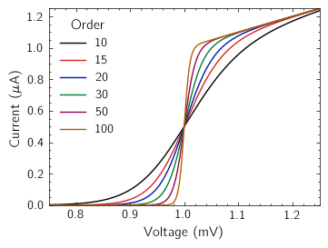
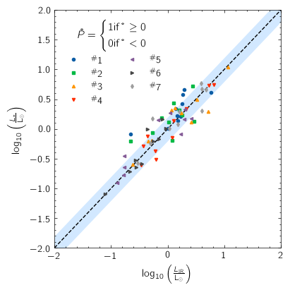
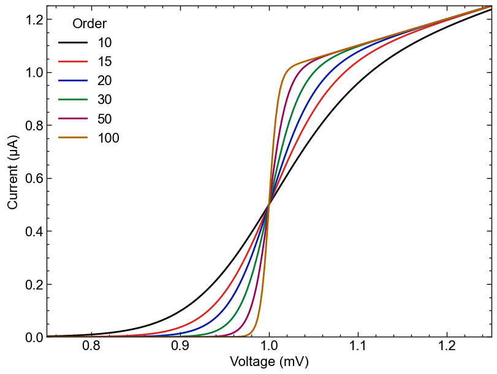
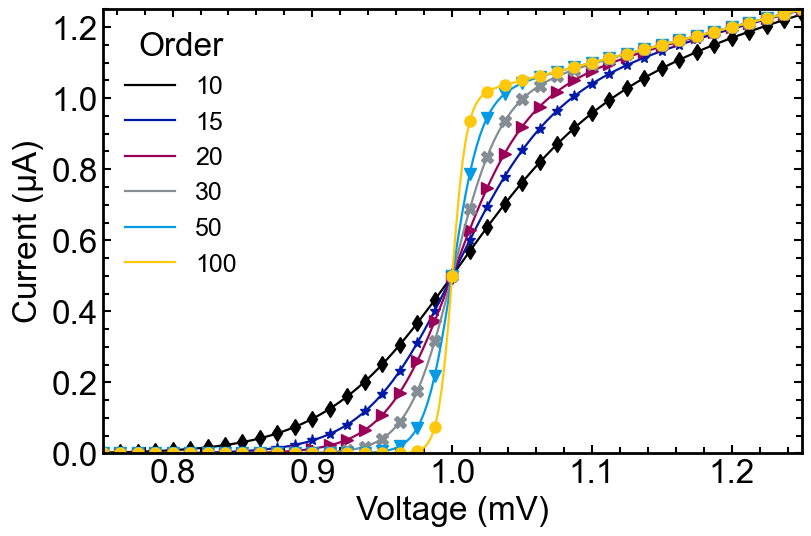
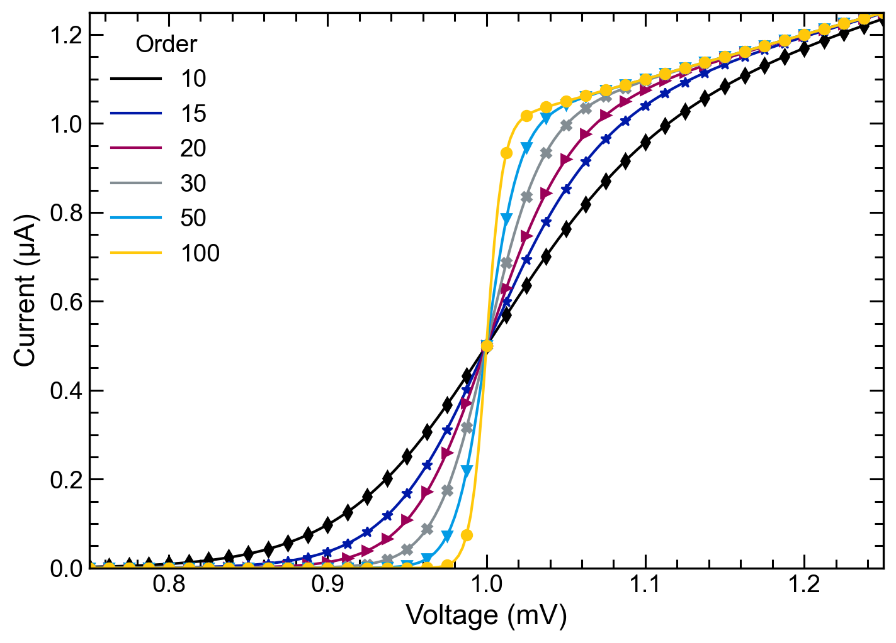
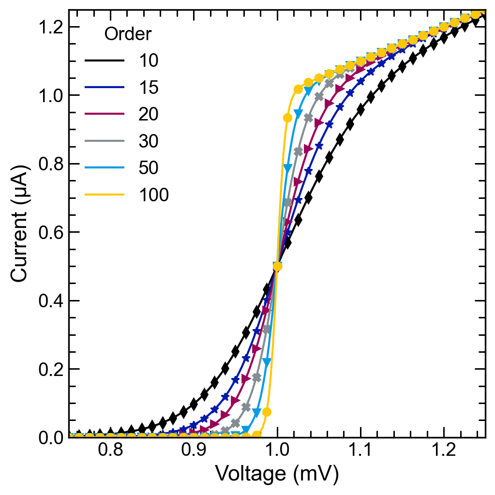
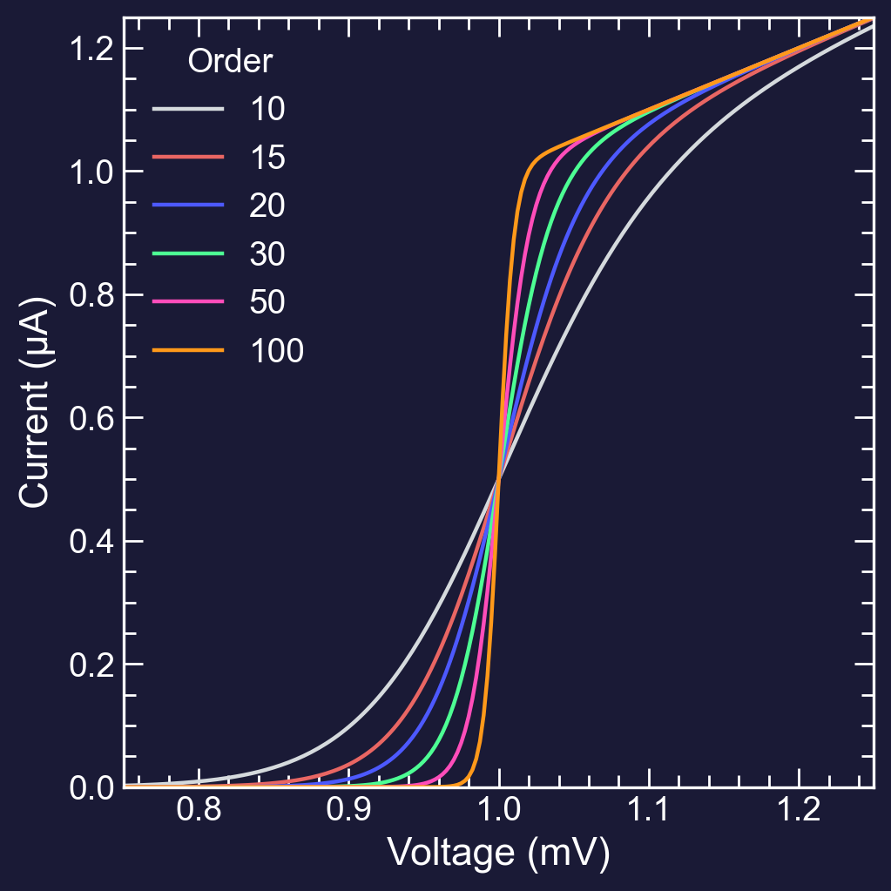
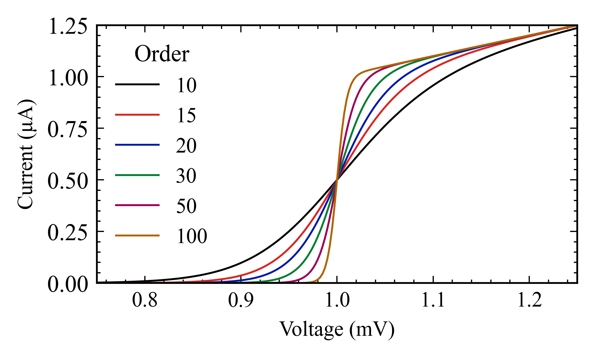
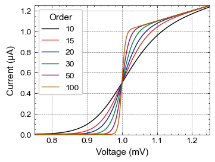
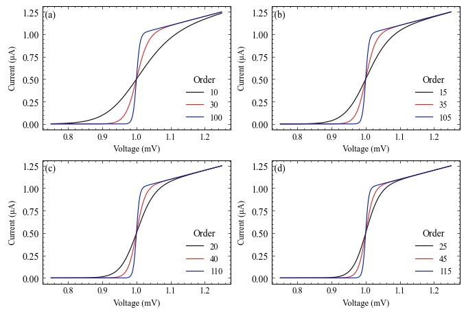

Stoner Plots Style Gallery
==========================

1.Default Styles
-----------------

Basic *stoner* style:
~~~~~~~~~~~~~~~~~~~~~

The basic stylesheet is the *stoner* stylesheet.::

    with SavedFigure(figures / "fig01a.png", style=["stoner"], autoclose=True):
        fig, ax = plt.subplots()
        for p in [10, 15, 20, 30, 50, 100]:
            ax.plot(x, model(x, p), label=p, marker="")
        ax.legend(title="Order")
        ax.autoscale(tight=True)
        ax.set(**pparam)

.. currentmodule:: stonerplots

.. image:: ../../examples/figures/fig01a.png
  :alt: Example figure formatted with the 'stoner' style sheet.
  :align: center

LaTeX Rendering
~~~~~~~~~~~~~~~

The basic stoner style uses matplotlib's builtin emulation of LaTeX to render mathemtatical expressions. Use the
*latex* modier to turn on LaTeX rendering of text and maths.::

    with SavedFigure(figures / "fig01b.png", style=["stoner", "latex"], autoclose=True):
        fig, ax = plt.subplots()
        for p in [10, 15, 20, 30, 50, 100]:
            ax.plot(x, model(x, p), label=p, marker="")
        ax.legend(title="Order")
        ax.autoscale(tight=True)
        ax.set(**pparam)

2. Journal Formats
------------------

There are specific stylesheets for producing plots at the correct size and style for some common Physics journals.

+-----------------------------------------------------+---------------------------------------------------+
|                                                     |                                                   |
| .. image:: ../../examples/figures/fig02a.png        | .. image:: ../../examples/figures/fig02b.png      |
|    :alt: Example fogure in IEEE format              |    :alt: Example figure in APS Format             |
|    :align: center                                   |    :align: center                                 |
|                                                     |                                                   |
| Using styles ["stoner", "ieee"]                     | Using styles ["stoner", "aps"]                    |
|                                                     |                                                   |
+-----------------------------------------------------+---------------------------------------------------+
|                                                     |                                                   |
| .. image:: ../../examples/figures/fig02c.png        | .. image:: ../../examples/figures/fig02d.png      |
|    :alt: Example fogure in AIP format               |    :alt: Example figure in IOP Format             |
|    :align: center                                   |    :align: center                                 |
|                                                     |                                                   |
| Using styles ["stoner", "aip"]                      | Using styles ["stoner", "iop"]                    |
|                                                     |                                                   |
+-----------------------------------------------------+---------------------------------------------------+
|                                                     |                                                   |
| .. image:: ../../examples/figures/fig02e.png        | .. image:: ../../examples/figures/fig02i_1.png    |
|    :alt: Example fogure in nature format            |   :alt: Example fogure in aaas-science format     |
|    :align: center                                   |   :align: center                                  |
|                                                     |                                                   |
| Using styles ["stoner", "nature"]                   | Using styles ["stoner", "aaas-science"]           |
|                                                     |                                                   |
+-----------------------------------------------------+---------------------------------------------------+
|                                                                                                         |
| .. image:: ../../examples/figures/fig02f.png                                                            |
|    :alt: Example fogure in APS 1.5 Column format                                                        |
|    :align: center                                                                                       |
|                                                                                                         |
| Using styles ["stoner", "aps","aps1.5"]                                                                 |
|                                                                                                         |
+-----------------------------------------------------+---------------------------------------------------+
|                                                                                                         |
| .. image:: ../../examples/figures/fig02g.png                                                            |
|    :alt: Example fogure in APS 2 Column format                                                          |
|    :align: center                                                                                       |
|                                                                                                         |
| Using styles ["stoner", "aps","aps2"]                                                                   |
|                                                                                                         |
+-----------------------------------------------------+---------------------------------------------------+
|                                                                                                         |
| .. image:: ../../examples/figures/fig02h_0.png                                                          |
|    :alt: Example plot in thesis template format                                                         |
|    :align: center                                                                                       |
|                                                                                                         |
| Using styles ["stoner", "thesis"]                                                                       |
|                                                                                                         |
+-----------------------------------------------------+---------------------------------------------------+
|                                                                                                         |
| .. image:: ../../examples/figures/fig02h_1.png                                                          |
|    :alt: Example twin plot in thesis template format                                                    |
|    :align: center                                                                                       |
|                                                                                                         |
| Using styles ["stoner", "thesis"] and MultiPanel with manual adjust_figsize=(0,-0.25)                   |
|                                                                                                         |
+-----------------------------------------------------+---------------------------------------------------+

3. Different Plot Types
-----------------------

There is a *scatter* plot style that sets up for doing scatter plots.

4. Different Colour Schemes
---------------------------

+-----------------------------------------------------+---------------------------------------------------+
|                                                     |                                                   |
| .. image:: ../../examples/figures/fig04a.png        | .. image:: ../../examples/figures/fig04b.png      |
|    :alt: Standard colours scheme                    |    :alt: Bright palette colour scheme             |
|    :align: center                                   |    :align: center                                 |
|                                                     |                                                   |
| Using styles ["stoner", "std-colours"]              | Using styles ["stoner", "bright"]                 |
|                                                     |                                                   |
+-----------------------------------------------------+---------------------------------------------------+
|                                                     |                                                   |
| .. image:: ../../examples/figures/fig04c.png        | .. image:: ../../examples/figures/fig04d.png      |
|    :alt: High contrast palette colour scheme        |    :alt: High visibility palette colour scheme    |
|    :align: center                                   |    :align: center                                 |
|                                                     |                                                   |
| Using styles ["stoner", "high-contrast"]            | Using styles ["stoner", "high-vis"]               |
|                                                     |                                                   |
+-----------------------------------------------------+---------------------------------------------------+
|                                                     |                                                   |
| .. image:: ../../examples/figures/fig04e.png        | .. image:: ../../examples/figures/fig04f.png      |
|    :alt: Light palette colour scheme                |    :alt: Muted palette colour scheme              |
|    :align: center                                   |    :align: center                                 |
|                                                     |                                                   |
| Using styles ["stoner", "light"]                    | Using styles ["stoner", "muted"]                  |
|                                                     |                                                   |
+-----------------------------------------------------+---------------------------------------------------+
|                                                     |                                                   |
| .. image:: ../../examples/figures/fig04g.png        | .. image:: ../../examples/figures/fig04h.png      |
|    :alt: Retro palette colour scheme                |    :alt: Vibrant palette colour scheme            |
|    :align: center                                   |    :align: center                                 |
|                                                     |                                                   |
| Using styles ["stoner", "retro"]                    | Using styles ["stoner", "vibrant"]                |
|                                                     |                                                   |
+-----------------------------------------------------+---------------------------------------------------+
|                                                     |                                                   |
| .. image:: ../../examples/figures/fig04i.png        |                                                   |
|    :alt: Dark themed plot figure                    |                                                   |
|    :align: center                                   |                                                   |
|                                                     |                                                   |
| Using styles ["stoner", "stoner-dark"]              |                                                   |
|                                                     |                                                   |
+-----------------------------------------------------+---------------------------------------------------+

In addition to switching the background to TfL Night Service black, the *stoner-dark* scheme also switches the colour
cycler to using the slightly lighter Tube Map 50% shade colours.

5. Different Formats
--------------------

Notebooks
~~~~~~~~~

The *notebook* style is designed for Jupyter Notebooks.

Posters
~~~~~~~

The *poster* style makes everything bigger for printing onto an A0 poster. Should be used in combination with *hi-res*
for final printing.

Presentations
~~~~~~~~~~~~~

The *presentation* style switches to a larger style, designed for use as a single graph on a PowerPoint presentation.

There is a *presnetation_sm* style for when you want two plots on a slide.

The *stoner_dark* style does make everything look a bit heavier and bolder, so the *presentation_dark* lightens
everything up.

High Resolution Mode
~~~~~~~~~~~~~~~~~~~~

In general for printed media you should pick a vector format for saving figures - such as eps, svg or pdf. It this
is not feasible and a bitmapped image is needed, then a higher dpi is needed. This can be done by using the *hi-res*
style.

6. Miscellaneous Tweaks
-----------------------

The *grid* style adds an axes grid to the plot.

This was produced with the style ["stoner", "grid"]

7. Insets and Multi-panel plots
-------------------------------

Inset Plots
~~~~~~~~~~~

The :py:class:`stonerplots.InsetPlot` context manager can be used to add a new set of axes as an inset to a plot.

.. image::  ../../examples/figures/fig07a.png
  :alt: Plot with inset in lower right corner
  :align: center

Stacked Sub-plots
~~~~~~~~~~~~~~~~~

When you want to compare several variables against a common independent variable, stacking the plots can be useful.
The :py:class:`stonerplots.StackVertical` context manager can be used for this.

.. image:: ../../examples/figures/fig7b.png
  :alt: 3-panel vertically stacked plot
  :align: center

MultiPanel Sub-plots
~~~~~~~~~~~~~~~~~~~~

Where a figure just needs to show a collection of related datasets, a multi-panel figure with sub-plots is a good
option. The :py:class:`stonerplots.MultiPanel` context manager makes this a bit easier.

