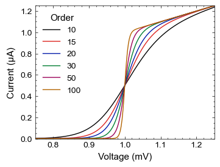

Stoner Plots Style Gallery
==========================

1. Default Styles
-----------------

Basic *stoner* style:
~~~~~~~~~~~~~~~~~~~~~

The basic stylesheet is the *stoner* stylesheet.::

    with SavedFigure(figures / "fig01a.png", style=["stoner"], autoclose=True):
        fig, ax = plt.subplots()
        for p in [10, 15, 20, 30, 50, 100]:
            ax.plot(x, model(x, p), label=p, marker="")
        ax.legend(title="Order")
        ax.autoscale(tight=True)
        ax.set(**pparam)

LaTeX Rendering
~~~~~~~~~~~~~~~

The basic stoner style uses matplotlib's builtin emulation of LaTeX to render mathemtatical expressions. Use the
*latex* modier to turn on LaTeX rendering of text and maths.::

    with SavedFigure(figures / "fig01b.png", style=["stoner", "latex"], autoclose=True):
        fig, ax = plt.subplots()
        for p in [10, 15, 20, 30, 50, 100]:
            ax.plot(x, model(x, p), label=p, marker="")
        ax.legend(title="Order")
        ax.autoscale(tight=True)
        ax.set(**pparam)

.. image:: ../../examples/figures/fig01b.png
  :alt: Example figure formatted with the 'stoner' style sheet.
  :align: center

2. Journal Formats
------------------

There are specific stylesheets for producing plots at the correct size and style for some common Physics journals.

+-----------------------------------------------------+---------------------------------------------------+
|                                                     |                                                   |
| .. image:: ../../examples/figures/fig02a.png        | .. image:: ../../examples/figures/fig02b.png      |
|    :alt: Example fogure in IEEE format              |    :alt: Example figure in APS Format             |
|    :align: center                                   |    :align: center                                 |
|                                                     |                                                   |
| Using styles ["stoner", "ieee"]                     | Using styles ["stoner", "aps"]                    |
|                                                     |                                                   |
+-----------------------------------------------------+---------------------------------------------------+
|                                                     |                                                   |
| .. image:: ../../examples/figures/fig02c.png        | .. image:: ../../examples/figures/fig02d.png      |
|    :alt: Example fogure in AIP format               |    :alt: Example figure in IOP Format             |
|    :align: center                                   |    :align: center                                 |
|                                                     |                                                   |
| Using styles ["stoner", "aip"]                      | Using styles ["stoner", "iop"]                    |
|                                                     |                                                   |
+-----------------------------------------------------+---------------------------------------------------+
|                                                     |                                                   |
| .. image:: ../../examples/figures/fig02e.png        |                                                   |
|    :alt: Example fogure in nature format            |                                                   |
|    :align: center                                   |                                                   |
|                                                     |                                                   |
| Using styles ["stoner", "nature"]                   |                                                   |
|                                                     |                                                   |
+-----------------------------------------------------+---------------------------------------------------+
|                                                                                                         |
| .. image:: ../../examples/figures/fig02f.png                                                            |
|    :alt: Example fogure in APS 1.5 Column format                                                        |
|    :align: center                                                                                       |
|                                                                                                         |
| Using styles ["stoner", "aps","aps1.5"]                                                                 |
|                                                                                                         |
+-----------------------------------------------------+---------------------------------------------------+
|                                                                                                         |
| .. image:: ../../examples/figures/fig02g.png                                                            |
|    :alt: Example fogure in APS 2 Column format                                                          |
|    :align: center                                                                                       |
|                                                                                                         |
| Using styles ["stoner", "aps","aps2"]                                                                   |
|                                                                                                         |
+-----------------------------------------------------+---------------------------------------------------+

3. Different Plot Types
-----------------------

4. Different Colour Schemes
---------------------------

5. Different Formats
--------------------

6. Miscellaneous Tweaks
-----------------------

7. Insets and Multi-panel plots
-------------------------------
