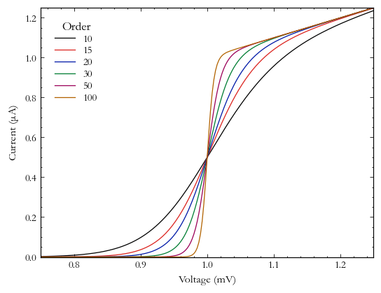

Stoner Plots User Guide
=======================

.. currentmodule:: stonerplots.context

Although you can make use of the style sheets directly in matplotlib after impriting stonerplots, it is anticipated
that using the :doc:`stonerplots<api>` context managers will be the main way of using the package.

The look of the various stylesheets is demonstrated in the :doc:`style gallery<style-gallery>` page.

Context Managers Primer
-----------------------

In Python, a context manager is used in a `with ... :` statement. Its main advantage is that it ensures that
initialisiation and cleanup code are executed around the enclosed block of statements, no matter why the code block
exited (e.g. due to an Exception or due to normal termination). This is generally used to ensure resources, such as
open network conenctions, open files etc. are opened and cleaned up properly.

For example, to open a file we might use something like::

    with open(filename,"r") as data_file:
        for line in data_file:
            ...

In this case, the :py:func:`open` function is being used not only to open the file for reading, but to create a
*context manager* that will also mak sure to close the file for you when executing moves out of the enclosed block.

The other reason a context manager might be used, is to temporarily change something in the environment the code is
running in for the duration of the enclosed lines of code. `Matplotlib <https://matplotlib.org/>`_ offers
context managers that operate in this way to temporarily set default parameters
(:py:func:`matplotlib.pyplot.rc_context`) or to temporarily apply stylesheets (py:func:`matplotlib.style.context`).

Using Stoner Plots to make thesis figures
-----------------------------------------

A common task that this package is aimed towards is to prepare figures for a project report, dissertation or thesis.
The task here is to try and make the figures look as consistent as possible so that your report/dissertation/thesis
looks profressional. You want to make all the plots have a similar format in tems of size, fonts, colous and for the
textual elelemtns of the plot to match the main text in size and style. Matplotlib's stylesheets help you do this, but
they still need some work to setup. The other thing you will need to do is to save your resulting figures to disk,
preferably in a vector format that can be easily imported into your document preparation system.

We'll assume that you areleady have a script that uses `matplotlib <https://matplotlib.org/>`_ to make your figures. First
you probably want to colate all the lines involved in plotting the same figure together so they can be inserted into
a block.

First of all we need to import the things we're going to need::

    import matplotlib.pyplot as plt
    import numpy as np
    ...
    from stonerplots import SavedFigure

The important line here is the final one. This willgive you access to the :py:class:`SavedFigure` context manager that
we'll be using, but also importing anything from **stonerplots** will also add some stylesheets and colours to
matplotlib.

You will probably also want to set up a variable with where your figures are supposed to go::

    from pathlib import Path
    figures = Path("/some/path/to/your/thesis/Chapters/Chapter_1/Chapter_1_figs")

(here we are using the layout of directories that we use in our standard LaTeX thesis teplate.)

To now make your thesis figures, you can do something like::

    with SavedFigure(figures/"fig_01", style=["stoner","thesis"],
                                formats=["png","eps"], autoclose=True):
        fig.ax = plt.subplots()
        ... # all your plotting commands
        ... # But don't plt.close() your figure!

When this executes you will find two files in your figures directory - `fig_01.png` and `fig_01.eps`. (If you are using
pdflatex, you might prefer to have `pdf` rather than `eps` figures). Let's breakdown what that call to
:py:class:`SavedFigure` is doing.

The first parameter is just the filename - minus the extension as we'll be adding that by specifying the formats.

The next parameter is the matplotlib stylesheets to use. The two sheeets here, `stoner` and `thesis` are included with
Stoner Plots and were made available as soon as we imported :py:class:`SavedFigure` above. Matplotlib stylesheets are
ummulative - so what you get here is the settings from the `stoner` style sheet and then any changed settings from
the `thesis` stylesheet. These two style sheets together are designed to make a figure that fits in well with the
`Condensed Matter Group's thesis template <https://github.com/stonerlab/Thesis-template>`_.

After specifying the *style* to use, we specify the *formats* to save the figure files in. Here we are asking for both
`png` and `eps` formats. Finally we ask SavedFigure to close any figures opened after it has saved them with the
*autoclose* parameter.

This is an example of a figure produces with a combination of `stoner` and `thesis` stylesheets.

For the full details see the :doc:`SavedFigure Guide<savedfigure>`.

Preparing a Figure for a Paper
------------------------------

Suppose that having gotten your python code to make a nice figure for your thesis or report, you now want to use it in
a paper submission. The general advice from scientifc journals is to prepare your figures as vector format files at as
close to the final size as you can. Unfortunately, different journals have different house styles (in terms of exact
figure sizes, font size and choice and so on) - so potentially there could be a lot of work sorting out the formatting
details that could be better spent writing good text.

Stoner Plots comes with stylesheets that are set up for the common Physics journal families such as APS, AIP, IEEE etc.
This makes switching from a figure for your thesis to a digure for a paper a matter of changing one line.::

    with SavedFigure(figures/"fig_01", style=["stoner","ieee"],
                                formats=["png","eps"], autoclose=True):
        fig.ax = plt.subplots()
        ... # all your plotting commands
        ... # But don't plt.close() your figure!

Here, by simply changing the style from `thesis` to `aps` we reset the figure size, all of the fonts, and other details
of the formatting.

.. image:: ../../examples/figures/fig02a.png
  :alt: IEEE format figure
  :align: center

This is what the figure looks like in IEEE format.

Double Column Figures
~~~~~~~~~~~~~~~~~~~~~

Sometimes a figure won't work wehen fitted into a single column of a two column journal. The Stoner Plots stylesheets
include some that change the figure sizes to be suitable for 1 1/2 or 2 column formats.::

    with SavedFigure(figures/"fig_01", style=["stoner","aps", "aps2"],
                                formats=["png","eps"], autoclose=True):
        fig.ax = plt.subplots()
        ... # all your plotting commands
        ... # But don't plt.close() your figure!

Note that the extra `aps2` stylesheet is used **in conjunction** to the `stoner` and `aps` stylesheets.

Preparing Poster or Presentation Figures
----------------------------------------

Having made your nice figures for your thesis and possibly a paper, you are likley to also want to use them for a talk
or poster. Again, the use of stylesheets lets you quickly swiotch formatting settings to be appropriate. For posters
and presentations, the main features are that you need to increase the size of all of the plot elements (lines, symbols
, fonts etc.). Generally we use something like PowerPoint to make posters and presentation (you can use LaTeX if you
have particularly masochistic tendencies!) and the easiest way to import the figures is as `.png` files.::

    with SavedFigure(figures/"fig_01.png", style=["stoner","[poster"], autoclose=True):
        fig.ax = plt.subplots()
        ... # all your plotting commands
        ... # But don't plt.close() your figure!

The `poster` stylesheet also increases the dpi of the image so that it will look good when printed on A0, albeit at the
expense of rather large images!

Similarly to the `poster` style there is a `presentation` style that makes figures suitable for placing into a standard
presentation. The defautl is make a plot that occupies the whole slide, but there is a `presentation_sm` style that
keeps the font sizes, lines etc) but reduces the size so you can fit two such plots on a slide.::

    with SavedFigure(figures/"fig_01.png",
                style=["stoner","presentation", "presentation_sm"], autoclose=True):
        fig.ax = plt.subplots()
        ... # all your plotting commands
        ... # But don't plt.close() your figure!

If you want to have a dark background to your presentation, then there is a `stoner_dark` stylesheet that sets colours
appropriately. One feature of dark plots in presentations is that the light-on-dark elements look heavier or bolder
than dark-on-light and so `presentation_dark` adjusts elements to make the overal weight look similar.::

    with SavedFigure(figures/"fig_01.png",
        style=["stoner","stoner_dark", "presentation", "presentation_dark"], autoclose=True):
        fig.ax = plt.subplots()
        ... # all your plotting commands
        ... # But don't plt.close() your figure!

Double and Multi-Panel Figures
------------------------------

When you want your reader/examiner to compare several related datasets, a multi-panel figure of some description can
be a useful way to show the data.

If you have several quantities that all functions of the same independent variable, and plotting them all on a single
set of axes would be overly complex, a stack of plots with a common x-axis can be a good choice. This can be a bit
awkward to achieve in matplotlib and so StonerPlots offers another context manager that makes this considerably easier.

StackVertical Context Manager
~~~~~~~~~~~~~~~~~~~~~~~~~~~~~

In this scenario you have several sets of plotting lines for each quantity ad just need to arrange the plots in a stack
with the top of one plot being the bottom of the next.::

    with SavedFigure("stacked.pong",style="stoner"):
        plt.figure() # Create the figure in the stoner style
        with StackVertical(3) as axes:  # create a stack of three plots
            ax1,ax2,ax3=axes # Unpack them to separae variables
            ax1.plot(...)
            ax2.plot(...)
            ax3.plot(...)

The :py:class:`SavedFigure` context manager is doing its usual thing here (note the style can be given as a simple
string). The :py:class:`StackVertical` context manager does the magic. When it is initially called, by default it will
adjust the figure height to make space for multiple plots. All you need to do is to tell it the number of plots that
should be stacked in the figure. Again, by default, :py:class:`StackVertical` will also label each plot (a), (b).. to
help identify each subplot in the figure caption. The return value from :py:class:`StackVertical` is a list of the plot
axes, starting from the top of the figure.

.. image:: ../../examples/figures/fig7b.png
  :alt: Stacked Plot
  :align: center

See :doc:`Stacked Plots<stackvertical>` for full details of :py:class:`StackVertical`.

.. note::
    :py:class:`StackVertical` will only adjust the plot positions togther when it exits - the reason for this is that
    it is only when plotting is finished that it can work out how to move the plots together for the stack. In
    particular, it will adjut the y-limits so that y-axis tick labels do not extend beyond the frame of the axes. A0
    However, if the y-axis label is longer than the axis then the plots will never be properly adjacent and manual
    addition of line breaks in the axis label may be required.

Side-bu-side Multi-panel Figures
~~~~~~~~~~~~~~~~~~~~~~~~~~~~~~~~

Another common requirement is to show several related sets of data together that do not share a common variable, and in
this case a multi-panel figure can be a good option. For this, Stoner Plots ships with a :py:class:`MulitPanel`
context manager.::

    with SavedFigure("multi_panel.pong",style="stoner"):
        plt.figure() # Create the figure in the stoner style
        with MultiPanel(2) as axes:  # create 2 figures next to each other
            ax1,ax2=axes # Unpack them to separae variables
            ax1.plot(...)
            ax2.plot(...)

As with the previous example, :py:class:`SavedFigure` handles the stylesheets and figure capture, whilst
:py:class:`MiltiPanel` creates and labels the sub-plot axes. The parameters for this are closely related to that for
:py:class:`StackVertical`, except the initial parameter can either be a single integer (representing the number of
plots to place beside each other), or a tuple of rows,columns of sub-plats.

See :doc:`Multi Panel Plots<multipanel>` for full details of the :py:class:`MultiPanel` context manager.

Inset Plots
-----------

The final scenario where you might need to show related datasets is where an inset is required to show a detail, or
perhaps an overview of the main plot axes. This again can be a fiddle with matplotlib to get insets that are placed
correctly without overlapping the parent axes. :py:class:`InsetPlot` can be used here.::

    with SavedFigure("multi_panel.pong",style="stoner"):
        fig,ax = plt.subplots()
        ax.plot(x_main,y_main)
        ...
        with InsetPlot() as inset:
            inset.plot(x_inset,y_inset)
            ...

:py:class:`InsetPlot` doesn't need any parameters, but it is possible to control where the inset gets placed, and its
size relative to the parent axes. See `Inset Plots<insetplot>` for the full explanation.

.. toctree::
   :maxdepth: 2

   Saving Figures <savedfigure>
   Stacked Plots <stackvertical>
   Multi-Panel Plots <multipanel>
   Inset Plots <insetplot>
