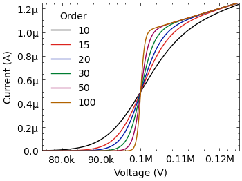
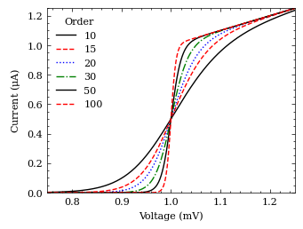
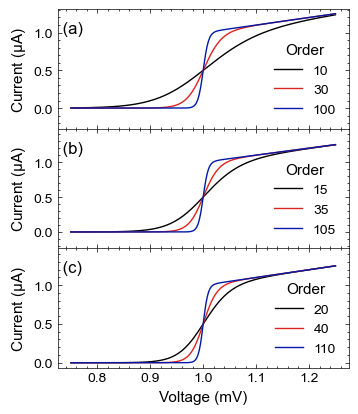

Stoner Plots User Guide
=======================

.. currentmodule:: stonerplots.context

Although you can make use of the style sheets directly in matplotlib after importing stonerplots, it is anticipated
that using the :doc:`stonerplots<api>` context managers will be the main way of using the package.

The look of the various stylesheets is demonstrated on the :doc:`style gallery<style-gallery>` page.

Context Managers Primer
-----------------------

In Python, a context manager is used in a `with ... :` statement. Its main advantage is that it ensures that
initialization and cleanup code are executed around the enclosed block of statements, no matter why the code block
exits (e.g., due to an Exception or due to normal termination). This is generally used to ensure resources, such as
open network connections, open files, etc., are opened and cleaned up properly.

For example, to open a file we might use something like::

    with open(filename, "r") as data_file:
        for line in data_file:
            ...

In this case, the :py:func:`open` function is being used not only to open the file for reading, but to create a
*context manager* that will also make sure to close the file for you when execution moves out of the enclosed block.

Another reason a context manager might be used is to temporarily change something in the environment the code is
running in for the duration of the enclosed lines of code. `Matplotlib <https://matplotlib.org/>`_ offers
context managers that operate in this way to temporarily set default parameters
(:py:func:`matplotlib.pyplot.rc_context`) or to temporarily apply stylesheets (py:func:`matplotlib.style.context`).

Using Stoner Plots to Make Thesis Figures
-----------------------------------------

A common task that this package is aimed towards is preparing figures for a project report, dissertation, or thesis.
The task here is to try and make the figures look as consistent as possible so that your report/dissertation/thesis
looks professional. You want to make all the plots have a similar format in terms of size, fonts, colors, and for the
textual elements of the plot to match the main text in size and style. Matplotlib's stylesheets help you do this, but
they still need some work to set up. The other thing you will need to do is save your resulting figures to disk,
preferably in a vector format that can be easily imported into your document preparation system.

We'll assume that you already have a script that uses `matplotlib <https://matplotlib.org/>`_ to make your figures. First,
you probably want to collate all the lines involved in plotting the same figure together so they can be inserted into
a block.

First of all, we need to import the things we're going to need::

    import matplotlib.pyplot as plt
    import numpy as np
    ...
    from stonerplots import SavedFigure

The important line here is the final one. This will give you access to the :py:class:`SavedFigure` context manager that
we'll be using, but also importing anything from **stonerplots** will also add some stylesheets and colors to
matplotlib.

You will probably also want to set up a variable with where your figures are supposed to go::

    from pathlib import Path
    figures = Path("/some/path/to/your/thesis/Chapters/Chapter_1/Chapter_1_figs")

(here we are using the layout of directories that we use in our standard LaTeX thesis template.)

To now make your thesis figures, you can do something like::

    with SavedFigure(figures / "fig_01", style=["stoner", "thesis"],
                                formats=["png", "eps"], autoclose=True):
        fig.ax = plt.subplots()
        ... # all your plotting commands
        ... # But don't plt.close() your figure!

When this executes you will find two files in your figures directory - `fig_01.png` and `fig_01.eps`. (If you are using
pdflatex, you might prefer to have `pdf` rather than `eps` figures). Let's break down what that call to
:py:class:`SavedFigure` is doing.

The first parameter is just the filename - minus the extension as we'll be adding that by specifying the formats.

The next parameter is the matplotlib stylesheets to use. The two sheets here, `stoner` and `thesis` are included with
Stoner Plots and were made available as soon as we imported :py:class:`SavedFigure` above. Matplotlib stylesheets are
cumulative - so what you get here is the settings from the `stoner` style sheet and then any changed settings from
the `thesis` stylesheet. These two style sheets together are designed to make a figure that fits in well with the
`Condensed Matter Group's thesis template <https://github.com/stonerlab/Thesis-template>`_.

After specifying the *style* to use, we specify the *formats* to save the figure files in. Here we are asking for both
`png` and `eps` formats. Finally, we ask SavedFigure to close any figures opened after it has saved them with the
*autoclose* parameter.

.. image:: ../../examples/figures/fig02h_0.png
  :alt: Thesis style figure
  :align: center

This is an example of a figure produced with a combination of `stoner` and `thesis` stylesheets.

For the full details see the :doc:`SavedFigure Guide<savedfigure>`.

Ensuring Axes Label Formatting
~~~~~~~~~~~~~~~~~~~~~~~~~~~~~~

Sometimes one wishes to plot very small or very large quantities. Labelling an axis with a number with too many
digits or too many 0 nefore the significant figures can make it very difficult to judge the actual order of magnitude
of the data.

The correct approach is to rescale the numbers being plotted on the axis so that they lie in the range 0.1-1000.0 and
make use of the appopriate SI prefix ahead of the physical unit. In some cases this is not possible - e.g. for
dimensionless quantities or when the scale is logarthmic. For rough working it might not be immediately obvious what
the scaloing factor is going to be ahead of plotting. In these circumstances, changign the axes tick formatter to one
that can provide an appropriate SI suffix to the number can be helpful. The stonerplots package provides such a
formatter - :py:class:`stonerplots.format.TexEngFormatter`. TO make this even easier to use, the
:py:class:`PlotLabeller` context manager will apply this for you automatically::

    with SavedFigure("double-y.png", style="stoner"), PlotLabeller():
        fig,ax = plt.subplots()
        ax.plot(...) # Usually plotting commands.

:py:class:`PlotLabeller` gets to work on exit from the context manager (if put this way round it is called before
the :py:class:`SavedFigure` can save the figure) to set the tick label formaating as needed. The formatter can handle
numbers between `1E-24` to `1E+24` - techncially further prefixes have been approved but they are little known!

Preparing a Figure for a Paper
------------------------------

Suppose that having gotten your Python code to make a nice figure for your thesis or report, you now want to use it in
a paper submission. The general advice from scientific journals is to prepare your figures as vector format files at as
close to the final size as you can. Unfortunately, different journals have different house styles (in terms of exact
figure sizes, font size and choice and so on) - so potentially there could be a lot of work sorting out the formatting
details that could be better spent writing good text.

Stoner Plots comes with stylesheets that are set up for the common Physics journal families such as APS, AIP, IEEE, etc.
This makes switching from a figure for your thesis to a figure for a paper a matter of changing one line::

    with SavedFigure(figures / "fig_01", style=["stoner", "ieee"],
                                formats=["png", "eps"], autoclose=True):
        fig.ax = plt.subplots()
        ... # all your plotting commands
        ... # But don't plt.close() your figure!

Here, by simply changing the style from `thesis` to `ieee` we reset the figure size, all of the fonts, and other details
of the formatting.

This is what the figure looks like in IEEE format.

Double Column Figures
~~~~~~~~~~~~~~~~~~~~~

Sometimes a figure won't work when fitted into a single column of a two-column journal. The Stoner Plots stylesheets
include some that change the figure sizes to be suitable for 1 1/2 or 2 column formats::

    with SavedFigure(figures / "fig_01", style=["stoner", "aps", "aps2"],
                                formats=["png", "eps"], autoclose=True):
        fig.ax = plt.subplots()
        ... # all your plotting commands
        ... # But don't plt.close() your figure!

Note that the extra `aps2` stylesheet is used **in conjunction** with the `stoner` and `aps` stylesheets.

Preparing Poster or Presentation Figures
----------------------------------------

Having made your nice figures for your thesis and possibly a paper, you are likely to also want to use them for a talk
or poster. Again, the use of stylesheets lets you quickly switch formatting settings to be appropriate. For posters
and presentations, the main features are that you need to increase the size of all of the plot elements (lines, symbols,
fonts, etc.). Generally, we use something like PowerPoint to make posters and presentation (you can use LaTeX if you
have particularly masochistic tendencies!). Modern versions of PowerPoint (and other MS Office applications) do not
support EPS files -- due to some security concerns with the format. The best format to use is `svg` as a vector
format the graphics will scale and print well at any size. Failing this, a high dpi png file can be used.::

    with SavedFigure(figures / "fig_01.svg", style=["stoner", "poster"], autoclose=True):
        fig.ax = plt.subplots()
        ... # all your plotting commands
        ... # But don't plt.close() your figure!

The `poster` stylesheet also increases the dpi of rasterised formats like png so that it will look good when printed on A0, albeit at the
expense of rather large images!

Similarly to the `poster` style, there is a `presentation` style that makes figures suitable for placing into a standard
presentation. The default is to make a plot that occupies the whole slide, but there is a `presentation_sm` style that
keeps the font sizes, lines, etc., but reduces the size so you can fit two such plots on a slide::

    with SavedFigure(figures / "fig_01.svg",
                style=["stoner", "presentation", "presentation_sm"], autoclose=True):
        fig.ax = plt.subplots()
        ... # all your plotting commands
        ... # But don't plt.close() your figure!

If you want to have a dark background for your presentation, there is a `stoner_dark` stylesheet that sets colors
appropriately. One feature of dark plots in presentations is that the light-on-dark elements look heavier or bolder
than dark-on-light, and so `presentation_dark` adjusts elements to make the overall weight look similar::

    with SavedFigure(figures / "fig_01.svg",
        style=["stoner", "stoner_dark", "presentation", "presentation_dark"], autoclose=True):
        fig.ax = plt.subplots()
        ... # all your plotting commands
        ... # But don't plt.close() your figure!

IF you need to put several graphs on the same presentation slide, then consider using the :py:class:`MultiPanel`
context manager in conjunction with presentation mode to keep the formatting optimal for presentation viewing --
do *not* be tempted to make several separate figures and resize them in PowerPoint as your labels will become too small!

Double and Multi-Panel Figures
------------------------------

When you want your reader/examiner to compare two related datasets with different y-ranges, you can use a double
y axis plot. With this, you place both quantities on the same plot, but one is reffere to a left hand y-axis and the
second to the right. Stonerplots offers the :py:class:`DoubleYAxis` context manager to help.

If you have several quantities that are all functions of the same independent variable, and plotting them all on
a single (or double) set of axes would be overly complex, a stack of plots with a common x-axis can be a good choice.
This can be a bit awkward to achieve in matplotlib and so StonerPlots offers the :py:class:`StackVertical` context
manager that makes this task considerably easier.

Finally, for more general multipanel figure plotting, stonerplots offers the :py:class:`MultiPanel` context manager
to setup the :py:class:`matplotlib.axes.Axes` instances for you. This can also suport iregular grids of panels as well
as regular ones.

Double Y Axis Plots
~~~~~~~~~~~~~~~~~~~

In this case, we have two quantities that need to be plotted on a common x axis, but the scales are rather different.
Furthermore, it can be useful to colour each scale, possibly to match the dataset being plotted.::

    with SavedFigure("double-y.png", style="stoner"):
        plt.figure() # Create the figure in the stoner style
        plt.plot(...) # Plot the first dataset using the default left-hand axes.
        with DoubleYAxis():
            plt.plot(...) # This now works with the second y-axis on the right of the plot.

The :py:class:`SavedFigure` context manager is doing its usual thing here (note the style can be given as a simple
string). The inner :py:class:`DoubleYAxis` context manager creates a second set of axes which share the x-axis of the
original plot. On exit from the context manager, it can optionally colour the left and right axes and by default will
also merge legends for the two sets of data and try to locate them on the best location, taking account of both sets
data.

.. image:: ../../examples/figures/fig7d.png
  :alt: Double Y axis plot
  :align: center

StackVertical Context Manager
~~~~~~~~~~~~~~~~~~~~~~~~~~~~~

In this scenario, you have several sets of plotting lines for each quantity and just need to arrange the plots in a stack
with the top of one plot being the bottom of the next::

    with SavedFigure("stacked.png", style="stoner"):
        plt.figure() # Create the figure in the stoner style
        with StackVertical(3) as axes:  # create a stack of three plots
            ax1, ax2, ax3 = axes # Unpack them to separate variables
            ax1.plot(...)
            ax2.plot(...)
            ax3.plot(...)

The :py:class:`StackVertical` context manager does the magic. When it is initially called, by default it will
adjust the figure height to make space for multiple plots. All you need to do is tell it the number of plots that
should be stacked in the figure. Again, by default, :py:class:`StackVertical` will also label each plot (a), (b),... to
help identify each subplot in the figure caption. The return value from :py:class:`StackVertical` is a list of the plot
axes, starting from the top of the figure.

See :doc:`Stacked Plots<stackvertical>` for full details of :py:class:`StackVertical`.

.. note::
    :py:class:`StackVertical` will only adjust the plot positions together when it exits - the reason for this is that
    it is only when plotting is finished that it can work out how to move the plots together for the stack. In
    particular, it will adjust the y-limits so that y-axis tick labels do not extend beyond the frame of the axes.
    However, if the y-axis label is longer than the axis, then the plots will never be properly adjacent and manual
    addition of line breaks in the axis label may be required.

Side-by-Side Multi-Panel Figures
~~~~~~~~~~~~~~~~~~~~~~~~~~~~~~~~

Another common requirement is to show several related sets of data together that do not share a common variable, and in
this case, a multi-panel figure can be a good option. For this, Stoner Plots ships with a :py:class:`MultiPanel`
context manager::

    with SavedFigure("multi_panel.png", style="stoner"):
        plt.figure() # Create the figure in the stoner style
        with MultiPanel(2) as axes:  # create 2 figures next to each other
            ax1, ax2 = axes # Unpack them to separate variables
            ax1.plot(...)
            ax2.plot(...)

As with the previous example, :py:class:`SavedFigure` handles the stylesheets and figure capture, whilst
:py:class:`MultiPanel` creates and labels the sub-plot axes. The parameters for this are closely related to those for
:py:class:`StackVertical`, except the initial parameter can either be a single integer (representing the number of
plots to place beside each other), or a tuple of rows, columns of sub-plots.

.. image:: ../../examples/figures/fig7c.png
  :alt: A single row of 2 sub-plots created from MultiPanel
  :align: center

See :doc:`Multi Panel Plots<multipanel>` for full details of the :py:class:`MultiPanel` context manager.

Inset Plots
-----------

The final scenario where you might need to show related datasets is where an inset is required to show a detail, or
perhaps an overview of the main plot axes. This again can be a fiddle with matplotlib to get insets that are placed
correctly without overlapping the parent axes. :py:class:`InsetPlot` can be used here::

    with SavedFigure("multi_panel.png", style="stoner"):
        fig, ax = plt.subplots()
        ax.plot(x_main, y_main)
        ...
        with InsetPlot() as inset:
            inset.plot(x_inset, y_inset)
            ...

:py:class:`InsetPlot` doesn't need any parameters, but it is possible to control where the inset gets placed and its
size relative to the parent axes. See `Inset Plots<insetplot>` for the full explanation.

.. toctree::
   :maxdepth: 2

   Saving Figures <savedfigure>
   Labelling Ticks <plotlabeller>
   Stacked Plots <stackvertical>
   Multi-Panel Plots <multipanel>
   Double-Y-Axis Plots <doubleyaxis>
   Inset Plots <insetplot>